# Parchee Edge

**Parchee Edge** is a medical scribe and claim-readiness assistant for low-connectivity clinics. It listens to a consultation, uses **Gemini 3.5 Transcribe** for intelligent speech-to-text plus **Gemini 3.5 Flash** for structured clinical extraction, and then runs offline ICD-10-CM / ICD-10-PCS coding so a clinician can review a cleaner, claim-ready record.

The core goal is not diagnosis automation; it is faster, private, clinician-controlled documentation.

## What It Does

| Feature | Description |
| --- | --- |
| Gemini 3.5 Transcribe scribe | Browser microphone audio is segmented by backend VAD and transcribed by `gemini-3.5-transcribe` via the Gemini API — smart transcription removes filler words, handles medical jargon, and auto-detects 85+ languages. |
| Structured clinical updates | `gemini-3.5-flash` returns strict JSON updates (via structured output) for demographics, symptoms, vitals, history, medications, procedures, diagnoses, and claim-relevant social fields. |
| Gemini summaries and notes | Post-visit summaries and `/api/generate-note` clinical note drafts use Gemini 3.5 Flash. |
| Adaptive audio windows | Speech starts and ends are detected automatically, so silence is skipped and short utterances do not wait for a full fixed buffer. |
| Offline ICD/PCS coding | ICD-10-CM and ICD-10-PCS suggestions use local TF-IDF, char n-gram, and ChromaDB semantic search. |
| Claim review workflow | Clinicians can inspect auto-coded encounters, search code databases, and confirm billing evidence. |
| Encrypted storage | Patient fields are encrypted at rest with AES-256-GCM before database persistence. |

## Architecture

```mermaid
flowchart LR
    Mic["Browser microphone"] --> Worklet["AudioWorklet\n16 kHz PCM"]
    Worklet --> WS["WebSocket\n/ws/live-consultation"]
    WS --> VAD["FastAPI adaptive VAD\nspeech windows only"]
    VAD --> WAV["PCM -> WAV"]
    WAV --> Transcribe["Gemini 3.5 Transcribe\npolished transcript"]
    Transcribe --> Extract["Gemini 3.5 Flash\nstructured JSON updates"]
    Extract --> UI["Live clinical form"]
    UI --> EHR["Commit to EHR"]
    EHR --> Coding["Offline ICD-10-CM / PCS coding\nTF-IDF + ChromaDB"]
    Coding --> Review["Billing / claim review"]
```



## Repository Layout

```text
backend/
  app/
    api/                     REST and WebSocket routes
    services/
      gemini_client.py             Gemini Interactions API REST client (retries, env loading)
      gemini_transcribe_service.py VAD + transcribe + extraction pipeline
      icd_coding_service.py         ICD-10-CM hybrid coding
      procedure_coding_service.py   ICD-10-PCS hybrid coding
      summarizer.py                 Gemini encounter summary + clinical notes
    database.py              encrypted persistence
  tests/                     Gemini pipeline, client, VAD, and parsing tests

frontend/
  app/                       Next.js app routes
  hooks/useAudioStream.ts    microphone capture hook
  public/worklet.js          browser PCM worklet

scripts/
  setup.py                   one-command bootstrap (venv, deps, env, postgres)
  validate_gemini.py         live validation against the Gemini API
```

## Requirements

- Windows, Linux, or macOS
- Python 3.11+
- Node.js 20+
- PostgreSQL for persistent EHR storage
- A Gemini API key ([get one free at Google AI Studio](https://aistudio.google.com/apikey))

No local model downloads are needed — inference runs on Google's Gemini API.

## One-Command Setup

```powershell
python scripts/setup.py
```

This single script handles everything:

| Step | What it does |
|---|---|
| Check prerequisites | Verifies Python 3.11+, Git, Docker |
| Create venv | Isolated Python environment in `.venv/` |
| Install deps | All Python packages + scispacy model |
| Configure env | Creates `.env` files with your Gemini API key and a generated AES-256 key |
| Start PostgreSQL | Launches via `docker compose up -d postgres` |
| Validate | Confirms the Gemini API key works against the live API |

After setup completes, start the services:

```powershell
# Terminal 1 - Backend
.venv\Scripts\python.exe -m uvicorn app.main:app --reload --port 8003

# Terminal 2 - Frontend
cd frontend
npm install
npm run dev
```

Open [http://localhost:3000](http://localhost:3000).

On startup, the backend will:

1. Load `backend/.env`.
2. Warm the ICD-10-CM and ICD-10-PCS coding services.

Configure models through `.env`:

```env
GEMINI_API_KEY=your_key
GEMINI_TRANSCRIBE_MODEL=gemini-3.5-transcribe
GEMINI_EXTRACT_MODEL=gemini-3.5-flash
GEMINI_CUSTOM_VOCABULARY=paracetamol, SpO2, bronchodilator   # optional
GEMINI_LANGUAGE=Hindi                                         # optional, empty = auto-detect
```

## Docker Compose

```powershell
docker compose up --build
```

Set `GEMINI_API_KEY` in the root `.env` before building; Compose passes it to the backend container.

## Verification

Backend tests:

```powershell
cd backend
python -m unittest discover -s tests
```

Live Gemini API validation (checks the key, transcription, extraction, and the full service pipeline):

```powershell
python scripts/validate_gemini.py path/to/audio.wav
```

Frontend build:

```powershell
cd frontend
npm run build
```

## Demo Flow

1. Start backend and frontend.
2. Begin consultation.
3. Speak a short Hinglish or English clinical encounter with vitals.
4. Watch fields populate from Gemini 3.5 Transcribe + Flash.
5. Commit to EHR.
6. Open Diagnostics/Billing to show ICD/PCS suggestions and claim review.

## Safety Note

Parchee Edge is documentation support software. It organizes clinician-spoken information and suggests billing codes for review. It should not be presented as autonomous diagnosis, treatment, or insurance approval software.
