# Parchee Edge

**Parchee Edge** is a local-first medical scribe and claim-readiness assistant for low-connectivity rural clinics. A doctor speaks during a consultation; the app listens over the browser microphone, transcribes speech **on-device with whisper.cpp**, extracts structured encounter data with a **local Gemma 3 model** (via llama.cpp), and runs offline **ICD-10-CM / ICD-10-PCS coding** so a clinician can review a cleaner, claim-ready record.

Built for the Kaggle Gemma 4 Good Hackathon. The goal is not autonomous diagnosis — it is faster, private, clinician-controlled documentation that works where the internet doesn't.


## Why local-first?

Rural clinics often have unreliable or nonexistent connectivity, strict patient-privacy requirements, and no budget for per-call API fees. Parchee Edge runs the entire scribe pipeline **on the clinic's own hardware**:

- **No hosted LLM or speech API keys required** for the default path.
- **Audio never leaves the building** — PCM → Whisper → Gemma all happen locally.
- **Encrypted at rest** with AES-256-GCM before anything is written to PostgreSQL.
- **Works offline** — ICD coding, summaries, and form extraction need no network.

The same OpenAI-compatible contract also lets you **swap in a hosted model with a single env var** if a clinic *does* have connectivity (see [API tokens vs. local deployment](#api-tokens-vs-local-deployment)).

## What It Does

| Feature | Description |
| --- | --- |
| Local Whisper ASR | whisper.cpp transcribes 16 kHz browser PCM into text with punctuation, entirely on-device. |
| Gemma 3 form extraction | A local Gemma 3 4B model (llama.cpp) converts transcript text into strict JSON field updates for the live form. |
| Adaptive streaming endpointing | VAD + punctuation decide when to send Whisper slices to the extractor; overlapping windows prevent words being lost across cuts. |
| Structured clinical updates | Demographics, symptoms, vitals, tentative diagnosis, and claim-relevant social fields (ration card, income, occupation, caste, housing, location). |
| Offline ICD/PCS coding | ICD-10-CM and ICD-10-PCS suggestions use local TF-IDF, char n-gram, and ChromaDB semantic search. |
| Claim review workflow | Clinicians inspect auto-coded encounters, search code databases, and confirm billing evidence. |
| Encrypted storage | Patient fields encrypted at rest with AES-256-GCM before database persistence. |
| Hardware profiles | One command switches between CPU, Vulkan, and CUDA runtimes (see below). |

## Architecture

```mermaid
flowchart LR
    Mic["Browser microphone"] --> Worklet["AudioWorklet\n16 kHz PCM"]
    Worklet --> WS["WebSocket\n/ws/live-consultation"]
    WS --> VAD["FastAPI adaptive VAD\nspeech windows only"]
    VAD --> Whisper["whisper.cpp\nlocal ASR"]
    Whisper --> Gemma["llama-server\nGemma 3 4B text"]
    Gemma --> JSON["Strict JSON\nfield updates"]
    JSON --> UI["Live clinical form"]
    UI --> EHR["Commit to EHR"]
    EHR --> Coding["Offline ICD-10-CM / PCS coding\nTF-IDF + ChromaDB"]
    Coding --> Review["Billing / claim review"]
```



The pipeline is split into two independent async workers so a slow model pass never stalls the next transcription:

1. **ASR worker** — runs whisper.cpp on each active audio slice, deduplicates overlap, and emits transcripts.
2. **Extraction worker** — accumulates transcript fragments until a sentence boundary, then streams Gemma 3's JSON output into the form in real time.

## Repository Layout

```text
backend/
  app/
    api/                      REST and WebSocket routes
    services/
      hardware_profiles.py          CPU/Vulkan/CUDA auto-detection
      llama_server_manager.py       downloads model assets and starts llama-server
      llama_cpp_gemma_service.py    PCM -> Whisper -> Gemma extraction pipeline
      icd_coding_service.py         ICD-10-CM hybrid coding
      procedure_coding_service.py   ICD-10-PCS hybrid coding
      summarizer.py                 local Gemma encounter summary / clinical note
    database.py               encrypted persistence
  llama_cpp/                  llama.cpp runtimes + GGUF models (installed by setup)
  whisper_cpp/                whisper.cpp runtimes + ASR model (installed by setup)
  tests/                      pipeline, parsing, and server-manager tests

frontend/
  app/                       Next.js app routes
  hooks/useAudioStream.ts    microphone capture hook
  lib/api.ts                 centralized backend URL config

docs/
  kaggle_writeup.md          submission writeup draft
  images/main-page.png       main UI screenshot
```

## Requirements

- **Windows, Linux, or macOS**
- **Python 3.11+** (3.14 supported)
- **Node.js 20+**
- **Docker** (only for PostgreSQL; also optional for the full Compose stack)
- **~5 GB free disk** (Whisper base.en model + Gemma 3 Q4_K_M GGUF)

Hardware (choose one profile):

| Profile | Hardware | Latency | Notes |
| --- | --- | --- | --- |
| `cpu` | Any x86-64 | Slowest | Works everywhere; use `ggml-base.en` Whisper + Q4_K_M GGUF. |
| `vulkan` | AMD / Intel / NVIDIA GPU with Vulkan | Fast | Accelerates Gemma offload; Whisper still uses CPU runtime (no official Windows Vulkan build). |
| `cuda` | NVIDIA GPU (CUDA 12.4) | Fastest | Accelerates both Gemma and Whisper. Requires NVIDIA drivers. |

## One-Command Setup (local, recommended)

```powershell
python scripts/setup.py
```

The script handles everything:

| Step | What it does |
|---|---|
| Check prerequisites | Verifies Python 3.11+, Git, Docker |
| Create venv | Isolated Python environment in `.venv/` |
| Install deps | All Python packages + scispacy clinical model |
| Detect hardware | Picks the best profile: CUDA → Vulkan → CPU (override with `--profile`) |
| Download runtimes | Matching llama.cpp + whisper.cpp binaries from GitHub releases |
| Download models | Gemma 3 GGUF via HuggingFace Hub (cached to `~/.cache/huggingface/`) + Whisper base.en |
| Configure env | Creates `backend/.env` with generated AES-256 key and real paths |
| Start PostgreSQL | Launches via `docker compose up -d postgres` |
| Validate | Confirms every asset is present |

After setup, start the services:

```powershell
# Terminal 1 - PostgreSQL
docker compose up -d postgres

# Terminal 2 - Backend (run from backend/)
cd backend
..\.venv\Scripts\python.exe -m uvicorn app.main:app --reload --port 8003

# Terminal 3 - Frontend
cd frontend
npm install
npm run dev
```

Open [http://localhost:3000](http://localhost:3000).

On startup, the backend loads `backend/.env`, starts `llama-server` on `127.0.0.1:8085`, and warms the ICD-10-CM / ICD-10-PCS coding services in the background.

## CPU, GPU, and model selection

### Choosing a hardware profile

`PARCHEE_HARDWARE_PROFILE` in `backend/.env` selects the runtime: `auto` (default), `cpu`, `vulkan`, `cuda`, or `custom`.

`auto` detects the best backend at setup time: `nvidia-smi` → CUDA, then a Vulkan loader → Vulkan, otherwise CPU.

Switch profiles without reinstalling anything:

```powershell
python scripts/setup.py --runtime-only --profile cpu
python scripts/setup.py --runtime-only --profile vulkan
python scripts/setup.py --runtime-only --profile cuda
```

- `--runtime-only` skips the venv rebuild and reuses your existing GGUF.
- **CUDA profile** installs CUDA 12.4 builds for both llama.cpp *and* whisper.cpp (plus the redistributable DLLs).
- **Vulkan profile** accelerates Gemma offload; Whisper falls back to CPU (whisper.cpp has no official Windows Vulkan build).
- `custom` lets you supply your own compiled runtimes via `LLAMA_SERVER_BINARY` and `WHISPER_CPP_BINARY`.

GPU layer offload is controlled by `LLAMA_SERVER_N_GPU_LAYERS`: `0` = CPU only, `999` = all possible layers. For a manual GPU build, set `custom` and point the binary paths at your build.

### Switching models (different GGUFs)

Any GGUF that llama.cpp supports works. Set these **before** running setup (or just point at an existing file):

```env
LLAMA_SERVER_MODEL_REPO=unsloth/gemma-3-4b-it-GGUF
LLAMA_SERVER_MODEL_FILENAME=gemma-3-4b-it-Q4_K_M.gguf
```

Or point `LLAMA_SERVER_MODEL` directly at a file you already downloaded and set `LLAMA_SERVER_DOWNLOAD_MODELS=false`.

Common options:

| Model | Quant | Size | Use |
| --- | --- | --- | --- |
| `unsloth/gemma-3-4b-it-GGUF` | `Q4_K_M` | ~2.7 GB | Default — best speed/quality for low-end hardware |
| `unsloth/gemma-3-4b-it-GGUF` | `Q5_K_M` | ~3.1 GB | Slightly better quality, needs a bit more RAM |
| `unsloth/gemma-3-4b-it-GGUF` | `Q8_0` | ~4.4 GB | Best quality for this model size |
| `google/gemma-3-12b-it-GGUF` | `Q4_K_M` | ~7.5 GB | Bigger model; needs a capable GPU or 16 GB+ RAM |
| `unsloth/gemma-3-1b-it-GGUF` | `Q4_K_M` | ~0.9 GB | Smallest — for very constrained machines |

Set `LLAMA_SERVER_MEMORY_BUDGET_GB` to a hard upper bound (e.g. `4`); the backend refuses to start llama-server if the GGUF exceeds it. Set `LLAMA_SERVER_CTX_SIZE` (default `4096`) lower on small machines to save memory.

### Replacing the ASR model

Whisper model files live in `whisper_cpp/models/`. Point `WHISPER_CPP_MODEL` at any `.bin` from [whisper.cpp models](https://huggingface.co/ggerganov/whisper.cpp/tree/main). `ggml-base.en` is the default; `ggml-small.en` transcribes more accurately at a small cost. For non-English or Hinglish consultations, swap to a multilingual model (e.g. `ggml-small.bin`).

## Docker Compose

```powershell
docker compose up --build
```

Runs PostgreSQL, llama-server, backend, and frontend as containers. By default the llama-server image is CPU-only. For NVIDIA GPU support, use the supplied override (requires [NVIDIA Container Toolkit](https://docs.nvidia.com/datacenter/cloud-native/container-toolkit/latest/install-guide.html)):

```powershell
docker compose -f docker-compose.yml -f docker-compose.gpu.yml up --build
```

> **Note:** the browser-microphone → Whisper pipeline uses native whisper.cpp binaries, so the **full live scribe** runs on the host via `scripts/setup.py`. Docker Compose is the best fit for the persisted EHR + llama-server + frontend stack, e.g. for a clinic with an on-prem server. (Docker GPU mode requires NVIDIA Container Toolkit.)

## API tokens vs. local deployment

Parchee Edge is built against the **OpenAI-compatible** `/v1/chat/completions` contract. That single decision means the same code, the same WebSocket pipeline, and the same JSON extraction all work against two very different backends:

### Strategy 1 — Fully local (default)

- `LLAMA_CPP_BASE_URL=http://127.0.0.1:8085` → the managed llama-server.
- `LLAMA_CPP_API_KEY=` (empty) → no auth header is sent.
- **Pros:** private, offline, zero per-consultation cost, no data leaves the clinic, works in low-connectivity areas.
- **Cons:** throughput is bounded by the clinic's hardware.

### Strategy 2 — Hosted OpenAI-compatible API

For clinics that *do* have connectivity but not enough local compute, change **two** env vars:

```env
LLAMA_CPP_BASE_URL=https://api.groq.com/openai/v1
LLAMA_CPP_MODEL_NAME=gemma-3-4b-it
LLAMA_CPP_API_KEY=your_token_here
```

Works with any OpenAI-compatible endpoint that serves a Gemma (or similar) model — Groq, OpenRouter, Together, Gemini's OpenAI-compat layer, local Ollama, etc. The audio pipeline stays local (Whisper + VAD on-device) — only the form-extraction and summarization calls go to the API.

- **Pros:** no local GPU needed, best-in-class model quality, scales with clinic size.
- **Cons:** requires connectivity, costs per token, patient transcript fragments leave the building (so it should only be used with a HIPAA/DPDP-compliant provider).

### What stays local in both modes

Regardless of which model backend you choose, these never touch the network:

- Microphone capture and VAD segmentation
- Whisper ASR (whisper.cpp)
- AES-256-GCM encryption and PostgreSQL storage
- ICD-10-CM / ICD-10-PCS coding (TF-IDF + ChromaDB + scispacy)
- The claim-review UI

This gives clinics a graceful degradation story: **connected hardware → best quality; disconnected hardware → still fully functional.**

## Verification

Backend tests:

```powershell
cd backend
..\.venv\Scripts\python.exe -m unittest discover -s tests
```

Frontend build:

```powershell
cd frontend
npm run build
```

## Hackathon Materials

- Kaggle writeup draft: [docs/kaggle_writeup.md](docs/kaggle_writeup.md)
- Demo flow:
  1. Start backend and frontend.
  2. Begin consultation.
  3. Speak a short Hinglish or English clinical encounter with vitals.
  4. Watch fields populate live from local Gemma 3.
  5. Commit to EHR.
  6. Open Diagnostics/Billing to show ICD/PCS suggestions and claim review.

## Safety Note

Parchee Edge is documentation support software. It organizes clinician-spoken information and suggests billing codes for review. It should not be presented as autonomous diagnosis, treatment, or insurance approval software.