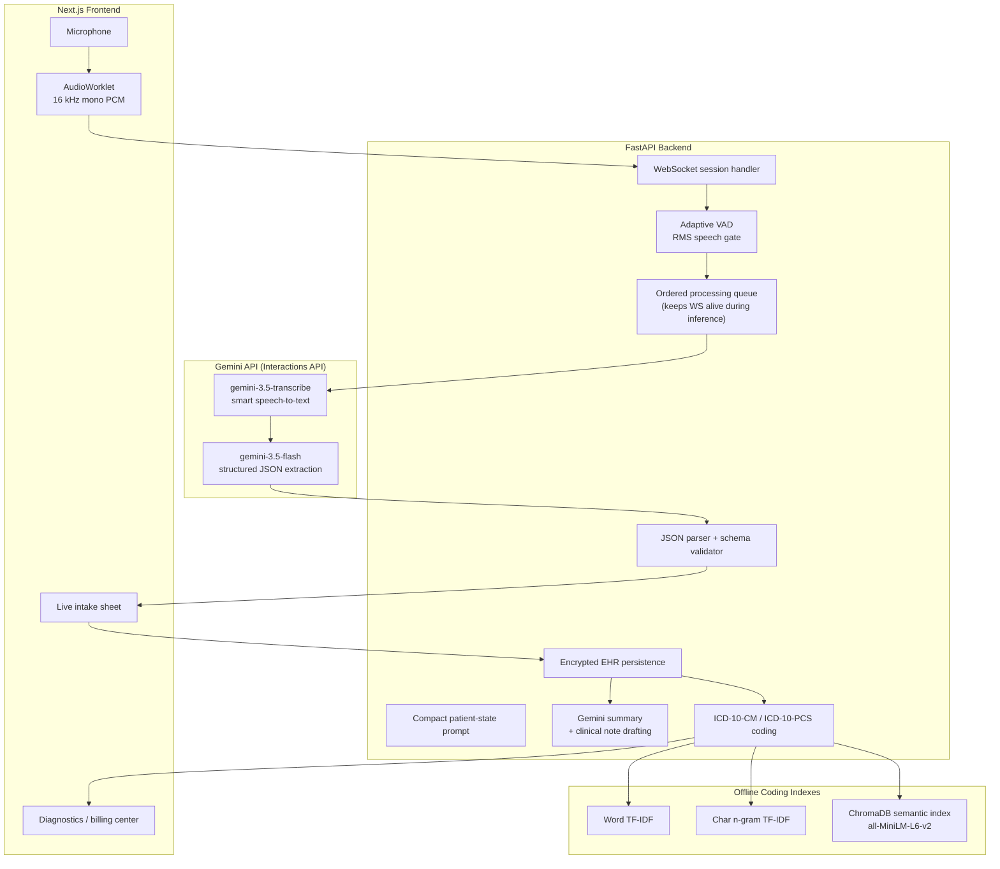

# Parchee Edge Architecture

Parchee Edge is organized around one inference loop: browser audio becomes short speech windows, Gemini 3.5 Transcribe converts those windows into polished transcripts, Gemini 3.5 Flash extracts structured clinical updates, and local coding services turn reviewed encounters into billing-ready evidence.

## System Diagram



## Audio Pipeline

1. The browser captures microphone input and converts it to 16 kHz mono PCM.
2. Audio frames are streamed to `/ws/live-consultation`.
3. The backend uses adaptive VAD to ignore silence and flush natural speech windows.
4. Each speech window is wrapped as WAV and sent to `gemini-3.5-transcribe` (Interactions API), which returns a polished transcript — filler words removed, medical jargon recognized, language auto-detected.
5. The transcript plus known patient state goes to `gemini-3.5-flash` with a JSON response schema, which returns strict updates:

```json
{
  "updates": [
    {"field": "chief_complaint", "value": "fever for 3 days"},
    {"field": "symptoms", "value": ["fever"]}
  ]
}
```

Chunks are processed by an ordered background worker so slow Gemini calls never stall the WebSocket receive loop (keepalive pings stay answered even when inference takes 10+ seconds).

## Gemini Runtime

All inference goes through the Gemini Interactions API (`POST /v1beta/interactions`, `x-goog-api-key` auth) via `app/services/gemini_client.py`, which adds:

- Automatic retries with exponential backoff on 429/5xx and network errors.
- `status: incomplete` detection so truncated output is never parsed as data.
- Env loading from repo root and `backend/` `.env` files.

Primary environment variables:

```env
GEMINI_API_KEY=your_key
GEMINI_TRANSCRIBE_MODEL=gemini-3.5-transcribe
GEMINI_EXTRACT_MODEL=gemini-3.5-flash
GEMINI_MAX_OUTPUT_TOKENS=4096
GEMINI_THINKING_LEVEL=low
GEMINI_CUSTOM_VOCABULARY=
GEMINI_LANGUAGE=
```

Note: `max_output_tokens` must be generous (4096) because Gemini 3.5 Flash is a thinking model — thought tokens count against the output budget. With a small cap the interaction ends `incomplete` and the JSON is truncated.

## Structured Extraction Schema

Gemini updates are accepted only if their field names are in the backend schema. Supported fields include:

- `name`, `age`, `gender`
- `chief_complaint`, `symptoms`
- `medical_history`, `family_history`, `allergies`, `medications`, `procedures`
- `ration_card_type`, `income_bracket`, `occupation`, `caste_category`, `housing_type`, `location`
- `tentative_doctor_diagnosis`, `initial_llm_diagnosis`, `transcript_summary`
- `vitals.temperature`, `vitals.blood_pressure`, `vitals.pulse`, `vitals.spo2`

List fields are merged and deduplicated across speech windows. Empty or malformed model responses are treated as no-op chunks so silence and noise do not crash the consultation.

## Coding Pipeline

ICD and procedure coding are separate from Gemini generation. This keeps the app explainable and fast:

- Exact code lookup returns immediately.
- Word TF-IDF handles direct clinical terminology.
- Character n-gram TF-IDF handles partial words and typos.
- ChromaDB semantic search handles concept-level similarity.

This makes the coding path fully offline after initial dependency setup.

## Privacy Position

- Patient audio is sent to the Gemini API for transcription and extraction (configurable models; no data is stored by the client beyond session state).
- Coding retrieval runs locally.
- Patient data is encrypted before storage.
